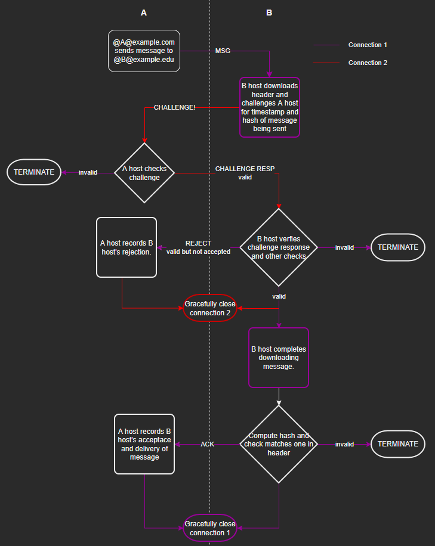

# fmsg

A message definition and protocol where messages are relational and verifiable by all peers. Messages are sent via a fmsg host to one or more recipients. Each message in a thread is linked to the previous using a cryptographic hash forming a hierarchical structure.

The lofty ambition of fmsg is to supersede electronic mail (email) keeping the good parts (like the ability to send messages directly to an address), and solving the bad (like spam and the inefficiency and inconsistency of clients concatenating email chains in different ways). The high level objectives of fmsg are:

* Verifiability – hosts cryptographically verify messages are "as written", the sending host can prove they are indeed sending the message, and, in the case of replies the sender has original.
* Ownership and control – messages are direct at the host level without routing via a third party. Anyone or entity can setup a host at their domain.
* Efficency – relational structure avoids duplication of messages, this combined with verifiability mitigates spam. Size of messages is as small as practically possible.
* Usability – user interfaces can utilise the structured hierarchy of messages.

Overall; fmsg aims to be a joyful, efficient and secure messaging system with ownership and control at the host level.


## Definition

In programmer friendly JSON a message looks like:

```JSON
{
    "version": 1,
    "flags": 0,
    "pid": null,
    "from": "@markmnl@fmsg.io",
    "to": [
        "@世界@example.com",
        "@chris@fmsg.io"
    ],
    "time": 1654503265.679954,
    "topic": "Hello fmsg!",
    "type": "text/plain;charset=UTF-8",
    "msg": "The quick brown fox jumps over the lazy dog."
}
```

On the wire messages are encoded thus:

|name|type|description|
|----|----|----|
|version| uint8 | Version number message is in (currently only 1); or 255 if CHALLENGE - defined below. |
|flags| uint8 | See fmsg flags for each bit's meaning.|
|pid| byte array | SHA-256 hash of message this message is a reply to. Only present if flags has pid bit set.|
|from| fmsg address | See fmsg address deifnition.|
|to| uint8 + list of fmsg address | See fmsg address definition. Prefixed by uint8 count, addresses must be distinct of which there must be at least 1.|
|timestamp| float64 | POSIX epoch time message was received by host sending the message.|
|topic| uint8 + UTF-8 string | UTF-8 prefixed by unit8 size making max length 255 characters.|
|type| uint8 + UTF-8 string | US-ASCII encoded MIME type: RFC 6838, of msg.|
|msg| unint32 + byte array | Sequence of octets prefixed by uint32 size making the max theoretical size but hosts can/should accept less.|
|attachments headers| uint8 + list of fmsg attachment headers | See fmsg attachment header definition. Prefixed by uint8 count of attachments of which there may be 0.|
|attachments data| byte array | Sequential binary blobs defined in attachment headers, if any.|

### Flags

|bit index|name|description|
|----:|:----|:----|
|0|has pid|Set if this message is in reply to another and pid field is present.|
|1|important|Sender indicates this message is IMPORTANT!|
|2|no reply|Sender indicates any reply will be discarded.|
|3|no challenge|Sender asks challenge skipped, hosts should be cautious accepting this, especially on the wild Internet. May be useful on trusted networks to save network and compute resources verifying many machine generated messages.|
|4| | |
|5| | |
|6| | |
|7|under duress|Sender indicates this message was written under duress.|

### Attachment

|name|type|comment|
|:----|:----|:----|
|filename|string|UTF-8 prefixed by unit8 size making max length of this field 255 characters.|
|size|unit32|Size of attachment making the max theoretical size, but hosts can/should accept less.|
| | | |
|data|byte array|Sequence of octets located after all other attachment headers and respective to other attachments.|

### Address


Domain part is the domain name RFC-1035 fmsg host is located. Recipient part identifies the recipient known to host located at domain. A leading @ character is prepended to distinguish from email addresses. The secondary @ seperates recipient and domain name as per norm.

Recipient part is a string of characters which must be:

* UTF-8
* any letter in any language, or any numeric characters
* the hyphen "-" or underscore "_" characters non-consecutively and not at beginning or end
* unique on host using case insensitive comparison
* less than 256 bytes length when combined with domain name and @ characters 

A whole address is encoded UTF-8 prepended with size:

|name   |type           |comment                                        |
|:------|:--------------|:----------------------------------------------|
|address|uint8 + string |UTF-8 encoded string prefixed with uint8 size  |

### Challenge

|name        |type      |comment                                                                            |
|:-----------|:---------|:----------------------------------------------------------------------------------|
|version     |uint8     |Must be 255 which indicates this messages is a challenge                           |
|header hash |32 bytes  |SHA-256 hash of message header being sent/recieved up to and including type field. |

### Challenge Response

A challenge response is the next 32 bytes recieved in reply to challenge request - the existance of which indicates the sender accepted the challenge. This SHA-256 hash should be kept to ensnure the message (and attachments) once downloaded matches.

|name|type|comment|
|:----|:----|:----|
| msg hash | 32 byte array | SHA-256 hash of entire message including header being sent/recieved. |

### Reject or Accept Response

A code less than 100 indicates rejection for all recipients and will be the only value. Other codes are per recipient for domain in the same order as the as in the to field of the message, excluding recipients for other domains.

|name   |type           |comment                                |
|:------|:--------------|:--------------------------------------|
| codes | byte array    | a single or sequence of unit8 codes   |


|code | name                  | description                                                             |
|----:|-----------------------|-------------------------------------------------------------------------|
| 1   | undisclosed           | no reason is given                                                      |
| 2   | too big               | message size exceeds host's maximum permitted size                      |
| 3   | insufficent resources | such as disk space to store the message or network quota                |
| 4   | parent unavaliable    | the parent is unavaliable at this time to verify pid supplied           |
| 5   | past time             | timestamp in the message is too far in the past for this host to accept |
| 6   | future time           | timestamp in message is too far in the future for this host to accept   |
| 7   | time travel           | timestamp in message is before parent timestamp                         |
|     |                       |                                                                         |
| 100 | user unknown          | the recipient message is addressed to is unknown by this host           |
| 101 | user full             | insufficent resources for specific recipient                            |
|     |                       |                                                                         |
| 255 | accept                | message recieved                                                        |


## Protocol

A message is sent from the sender's host to each unique recipient host (i.e. each unqiue domain). Sending a message either wholly succeeds or fails to each recipient. During the sending from one host to another several steps are performed depicted in the below flow diagram. 
Two connection-orientated, reliable, in-order and duplex transports are required to perform the full flow. Transmission Control Protocol (TCP) is an obvious choice, on top of which Transport Layer Security (TLS) may meet your encryption needs.



*Protocol flow diagram*

### Note

* Each of the WORDS IN CAPS on a connection line in the above flow diagram is for a defined message per definitions above.
* A new connection is opened from the recieving host to the purported sender's domain so the receiving host can verify sending host indeed exists _and_ can prove they are sending this message (in the CHALLENGE, CHALLENGE RESP exchange). 
* A host reaching the TERMINATE step should tear down connection(s) without regard for the other end because they must be either malicious or not following the protocol! 
* Where a message is being sent and connection closed, closing only starts after message is sent/recieved, i.e. not concurrently.
