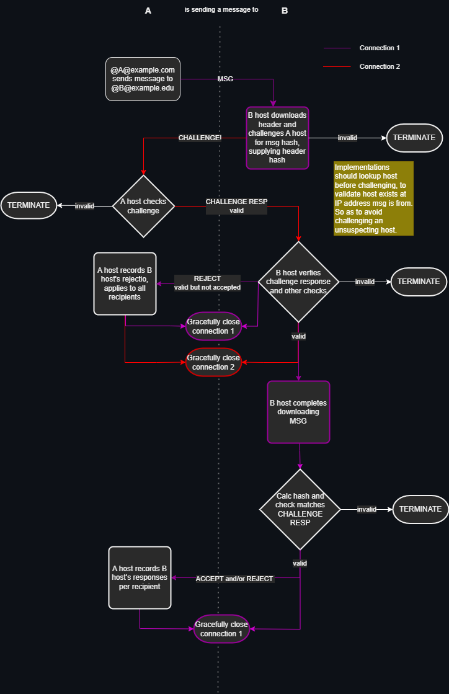

# fmsg Specification

- [Terminology](#terminology)
    - [Terms](#terms)
    - [Message Types](#message-types)
    - [Data Types](#data-types)
- [Definition](#definition)
    - [Message](#message)
        - [Common MIME Types](#common-mime-types)
    - [Flags](#flags)
    - [Attachment](#attachment)
    - [Address](#address)
    - [Challenge](#challenge)
    - [Challenge Response](#challenge-response)
    - [Reject or Accept Response](#reject-or-accept-response)
- [Protocol](#protocol)
    - [Flow diagram](#protocol)


## Terminology

_"fmsg"_ is the name given to the protocol and message definitions described in this document. The name "fmsg" is neither an abbreviation nor acronym, instead is thought of as "f-message". The "f" is inspired from popular programming languages such as C's `printf` where the "f" stands for "formatted", "msg" is a common shortening of "message" conveying the meaning while keeping the whole name succinct; "fmsg".


### Terms

_"DNS"_ is for the Domain Name System

_"host"_ is an fmsg implementation which can send and receive fmsg messages to and from other hosts.

_"message"_ refers to an entire message described in [Message](#message) definition.

_"message header"_ refers to the fields up to and including the attachment headers field in a _message_.

_"thread"_ is a linked heirarchy of messages where messages relate to previous messages using the pid field

_"UTF-8"_ is for the unicode standard: Unicode Transformation Format – 8-bit.


### Message Types

fmsg defines four message types: MESSAGE, CHALLENGE, CHALLENGE RESPONSE and "REJECT or ACCEPT RESPONSE". These structures are aggregates of [Data Types](#data-types) and are described in the [Definition](#definition) section.


### Data Types

Throughout this document the following data types are used. All types are encoded little-endian.

| name       | description                                                                                                          |
|------------|----------------------------------------------------------------------------------------------------------------------|
| uint8      | 8 bit wide unsigned integer with a value in the set 0 to 255                                                         |
| uint16     | 16 bit wide unsigned integer with a value in the set 0 to 65535                                                      |
| uint32     | 32 bit wide unsigned integer with a value in the set 0 to 4294967295                                                 |
| bit        | single bit 0 or 1 within one of the uint types, the 0 based index of which is defined alongside in this document     |
| float64    | 64 bit wide number in the set of all IEEE-754 64-bit floating-point numbers                                          |
| byte       | a uint8                                                                                                              |
| byte array | sequence of uint8 values the length of which is defined alongside in this document                                   |
| bytes      | a byte array                                                                                                         |
| string     | sequence of characters the length and encoding (e.g. ASCII, UTF-8...) of which is defined alongside in this document |


String lengths are always explicitly defined and null terminating characters are not used. This is a design decision becuase it prevents a class of buffer over-run bugs (search "Heartbleed bug"), simplifies message size calculation, and, inherently limits the length of strings while adding no extra data than a null terminating character would (since all strings lengths here are defined by one uint8).


## Definition

### Message

In programmer friendly JSON a message could look like (once decoded from the binary format defined below):

```JSON
{
    "version": 1,
    "flags": 0
    "pid": null,
    "from": "@markmnl@fmsg.org",
    "to": [
        "@世界@example.com",
        "@chris@fmsg.org"
    ],
    "time": 1654503265.679954,
    "topic": "Hello fmsg!",
    "type": "text/plain;charset=UTF-8",
    "size": 45,
    "data": "The quick brown fox jumps over the lazy dog.",
    "attachments": [
        {
            "size": 1024,
            "filename": "doc.pdf"
        }
    ]
}
```

On the wire messages are encoded thus:

| name                | type                                 | description                                                                                                                                                     |
|---------------------|--------------------------------------|-----------------------------------------------------------------------------------------------------------------------------------------------------------------|
| version             | uint8                                | Version number message is in (currently only 1); or 255 if CHALLENGE – defined below.                                                                           |
| flags               | uint8                                | See [flags](#flags) for each bit's meaning.                                                                                                                     |
| [pid]               | byte array                           | SHA-256 hash of message this message is a reply to. Only present if flags has pid bit set.                                                                      |
| from                | fmsg address                         | See [address](#address) definition.                                                                                                                             |
| to                  | uint8 + list of fmsg address         | See [address](#address) definition. Prefixed by uint8 count, addresses MUST be distinct (case-insensitive) of which there MUST be at least one.                 |
| time                | float64                              | POSIX epoch time message was received by host sending the message.                                                                                              |
| topic               | uint8 + [UTF-8 string]               | UTF-8 free text title of the message thread, prefixed by unit8 size which may be 0.                                                                             |
| type                | uint8 + [ASCII string]               | Either a common type, see [Common MIME Types](#common-mime-types), or a US-ASCII encoded Media Type: RFC 6838.                                                  |
| size                | uint32                               | Size of data in bytes, 0 or greater                                                                                                                             |
| attachment headers  | uint8 + [list of attachment headers] | See [attachment](#attachment) header definition. Prefixed by uint8 count of attachments of which there may be 0.                                                |
| data                | byte array                           | The message body of type defined in type field and size in the size field                                                                                       |
| [attachments data]  | byte array(s)                        | Sequential sequence of octets boundries of which are defined by attachment headers size(s), if any.                                                             |


### Notes on Message Definition

* Square brackets "[ ]" indicate fields or part thereof may not exist on a message. Where the brackets surround the name, e.g. pid, the whole field my not be present (which in the case of pid is only valid if the message is not a reply). Where they surround part of the type, that part may not be present, e.g. list of attachment headers will not be present if unit8 prefix is 0.
* Topic is set only on the first message sent in a thread, thereafter topic size is always 0. Making topic immutable because it cannot be changed by subsequent replies. (Presentations of message threads COULD use a local mutable field for display).


### Notes on Time

Only one time field is present on a message and this time is stamped by the sending host when it acquired the message. (Implementations COULD associate additional timestamps with messages, such as the time message was delivered).

fmsg includes some time checking and controls, rejecting messages too far in future or past compared to current time of the receiver, and, checking replies cannot claim to be sent before their parent (See [Reject or Accept Response](#reject-or-accept-response)). Of course this all relies on accuracy of clocks being used, so some leniancy is granted determined by the receiving host. Bearing in mind a host may not be reachable for some time so greater leniancy SHOULD be given to messages from the past. Since the time field is stamped by the sending host – one only need concern themselves that their clock is accurate.


### Flags

| bit index | name         | description                                                                                                                                                                                                                 |
|----------:|--------------|-----------------------------------------------------------------------------------------------------------------------------------------------------------------------------------------------------------------------------|
| 0         | has pid      | Set if this message is in reply to another and pid field is present.                                                                                                                                                        |
| 1         | common type  | Indicates the type field is just a uint8 value and Media Type can be looked up per [Common MIME Types](#common-mime-types)                                                                                                  |
| 2         | important    | Sender indicates this message is IMPORTANT!                                                                                                                                                                                 |
| 3         | no reply     | Sender indicates any reply will be discarded.                                                                                                                                                                               |
| 4         | no challenge | Sender asks challenge skipped, hosts accepting unsolicited messages SHOULD be cautious accepting this, especially on the wild Internet.                                                                                     |
| 5         | deflate      | Message data is compressed using the zlib structure (defined in RFC 1950), with the deflate compression algorithm (defined in RFC 1951).                                                                                    |
| 6         |    | Unused                                                       |
| 7         | under duress | Sender indicates this message was written under duress.    |


#### Common Media Types

If the common type flag bit is set in the flags field, then type field consists of one uint8 value which maps to the Media Type including parameters in the table below. A value not in the table is invalid and the entire message SHOULD be rejected with "invalid" REJECT response. If the common type bit is not set the first uint8 is the length of the subsequent bytes US-ASCII encoded Media Type per RFC 6838. Note, even if the common type flag bit is not set (i.e. the Media Type is spelt out in full), the Media Type may be one of these "common" types.

For reference the current IANA list of Media Types is located [here](https://www.iana.org/assignments/media-types/media-types.xhtml).

<details>
  <summary>Numerical identifier to common Media Types mapping.</summary>

| number | Media Type                                                                |
|--------|---------------------------------------------------------------------------|
| 1      | application/epub+zip                                                      |
| 2      | application/json                                                          |
| 3      | application/msword                                                        |
| 4      | application/octet-stream                                                  |
| 5      | application/pdf                                                           |
| 6      | application/rtf                                                           |
| 7      | application/vnd.amazon.ebook                                              |
| 8      | application/vnd.ms-excel                                                  |
| 9      | application/vnd.ms-fontobject                                             |
| 10     | application/vnd.ms-powerpoint                                             |
| 11     | application/vnd.oasis.opendocument.presentation                           |
| 12     | application/vnd.oasis.opendocument.spreadsheet                            |
| 13     | application/vnd.oasis.opendocument.text                                   |
| 14     | application/vnd.oasis.opendocument.text-web                               |
| 15     | application/vnd.openxmlformats-officedocument.presentationml.presentation |
| 16     | application/vnd.openxmlformats-officedocument.spreadsheetml.sheet         |
| 17     | application/vnd.openxmlformats-officedocument.wordprocessingml.document   |
| 18     | application/xhtml+xml                                                     |
| 19     | application/xml                                                           |
| 20     | application/zip                                                           |
| 21     | audio/aac                                                                 |
| 22     | audio/midi                                                                |
| 23     | audio/ogg                                                                 |
| 24     | audio/opus                                                                |
| 25     | audio/wav                                                                 |
| 26     | audio/webm                                                                |
| 27     | font/otf                                                                  |
| 28     | font/ttf                                                                  |
| 29     | font/woff                                                                 |
| 30     | font/woff2                                                                |
| 31     | image/apng                                                                |
| 32     | image/avif                                                                |
| 33     | image/bmp                                                                 |
| 34     | image/gif                                                                 |
| 35     | image/jpeg                                                                |
| 36     | image/png                                                                 |
| 37     | image/svg+xml                                                             |
| 38     | image/tiff                                                                |
| 39     | image/webp                                                                |
| 40     | text/calendar                                                             |
| 41     | text/css                                                                  |
| 42     | text/csv                                                                  |
| 42     | text/markdown                                                             |
| 43     | text/html                                                                 |
| 44     | text/javascript                                                           |
| 45     | text/plain;charset=ASCII                                                  |
| 46     | text/plain;charset=UTF-16                                                 |
| 47     | text/plain;charset=UTF-8                                                  |
| 48     | text/vcard                                                                |
| 48     | video/H264                                                                |
| 49     | video/H264-RCDO                                                           |
| 50     | video/H264-SVC                                                            |
| 51     | video/H265                                                                |
| 52     | video/H266                                                                |
| 53     | video/ogg                                                                 |
| 54     | video/VP8                                                                 |
| 55     | video/VP9                                                                 |
| 56     | video/webm                                                                |
| 57     | model/3mf                                                                 |
| 59     | model/gltf-binary                                                         |
| 60     | model/obj                                                                 |
| 61     | model/stl                                                                 |
| 62     | model/step

</details>


### Attachment

Attachment headers consist of the two fields, filename and size:

| name     | type       | comment                                                                                            |
|----------|------------|----------------------------------------------------------------------------------------------------|
| filename | string     | UTF-8 prefixed by unit8 size.                                                                      |
| size     | unit32     | Size of attachment data. unit32 is the max theoretical size, but hosts can/should accept less.     |

filename MUST be:

* UTF-8
* any letter in any language, or any numeric characters (`\p{L}` and `\p{N}` Unicode Standard Annex #44 and #18)
* the hyphen "-" or underscore "_" characters non-consecutively and not at beginning or end
* unique amongst attachments, case-sensitive
* less than 256 bytes length

Attachment data

| name     | type       | comment                                                                                            |
|----------|------------|----------------------------------------------------------------------------------------------------|
| data     | byte array | Sequence of octets located after all attachment headers, boundaries of each attachment are defined by corresponding size in attachment header(s) |


### Address


Domain part is the domain name RFC-1035 owning the address. Recipient part identifies the recipient known to hosts for the domain. A leading "@" character is prepended to distinguish from email addresses. The secondary "@" seperates recipient and domain name as per norm.

Recipient part is a string of characters which MUST be:

* UTF-8
* any letter in any language, or any numeric characters (`\p{L}` and `\p{N}` Unicode Standard Annex #44 and #18)
* the hyphen "-" or underscore "_" characters non-consecutively and not at beginning or end
* unique on host using case-insensitive comparison
* less than 256 bytes length when combined with domain name and @ characters 

A whole address is encoded UTF-8 prepended with size:

| name    | type           | comment                                       |
|---------|----------------|-----------------------------------------------|
| address | uint8 + string | UTF-8 encoded string prefixed with uint8 size |


### Challenge

| name        | type     | comment                                                                            |
|-------------|----------|------------------------------------------------------------------------------------|
| version     | uint8    | MUST be 255 which indicates this messages is a challenge                           |
| header hash | 32 bytes | SHA-256 hash of message header being sent/received up to and including type field. |


### Challenge Response

A challenge response is the next 32 bytes received in reply to challenge request – the existance of which indicates the sender accepted the challenge. This SHA-256 hash SHOULD be kept to ensure the complete message (including attachments) once downloaded matches.

| name     | type          | comment                                                              |
|----------|---------------|----------------------------------------------------------------------|
| msg hash | 32 byte array | SHA-256 hash of entire message.                                      | 


### Reject or Accept Response

A code less than 100 indicates rejection for all recipients and will be the only value. Other codes are per recipient in the same order as the as in the to field of the message excluding recipients for other domains.

| name  | type       | comment                             |
|-------|------------|-------------------------------------|
| codes | byte array | a single or sequence of unit8 codes |


| code | name                  | description                                                             |
|-----:|-----------------------|-------------------------------------------------------------------------|
| 1    | invalid               | the message is malformed, i.e. not in spec, and cannot be decoded       |
| 2    | unsupported version   | the version is not supported by the receiving host                      |
| 3    | undisclosed           | no reason is given                                                      |
| 4    | too big               | total size exceeds host's maximum permitted size of messages            |
| 5    | insufficent resources | such as disk space to store the message                                 |
| 6    | parent not found      | parent referenced by pid not found                                      |
| 7    | past time             | timestamp is too far in the past for this host to accept |
| 8    | future time           | timestamp is too far in the future for this host to accept   |
| 9    | time travel           | timestamp is before parent timestamp                         |
| 10   | duplicate             | message has already been received                                       |
| 11   | must challenge        | no challenge was requested but is required                              |
| 12   | cannot challenge      | challenge was requested by sender but receiver is configured not to     |
|      |                       |                                                                         |
| 100  | user unknown          | the recipient message is addressed to is unknown by this host           |
| 101  | user full             | insufficent resources for specific recipient                            |
|      |                       |                                                                         |
| 200  | accept                | message received, no more data                                          |


## Protocol

A message is sent from the sender's host to each unique recipient host (i.e. each domain only once even if multiple recipients with the same domain). Sending a message either wholly succeeds or fails per recipient. During the sending from one host to another several steps are performed depicted in the below flow diagram. 
Two connection-orientated, reliable, in-order and duplex transports are required to perform the full flow. Transmission Control Protocol (TCP) is an obvious choice, on top of which Transport Layer Security (TLS) may meet your encryption needs, or even better why not use [QUIC] RFC 9000: "QUIC: A UDP-Based Multiplexed and Secure Transport".



*Protocol flow diagram*

### Notes

* When challenging, a new connection is opened from the receiving host to the purported sender so the receiving host can verify sending host indeed exists _and_ can prove they are sending this message (in the CHALLENGE, CHALLENGE RESP exchange).
* A host reaching the TERMINATE step SHOULD tear down connection(s) without regard for the other end because they must be either malicious or not following the protocol! 
* Where a message is being sent and connection closed in the diagram, closing only starts after message is sent/received, i.e. not concurrently.


