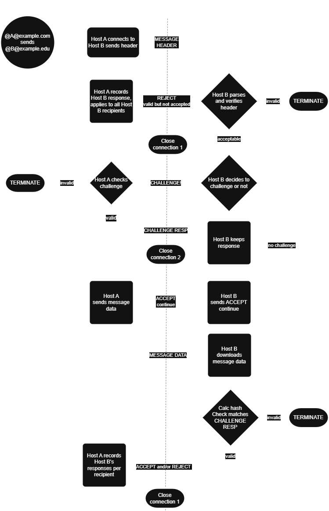

# fmsg Specification

- [Terminology](#terminology)
    - [Terms](#terms)
    - [Message Types](#message-types)
    - [Data Types](#data-types)
- [Definition](#definition)
    - [Message](#message)
        - [Common Media Types](#common-media-types)
    - [Flags](#flags)
    - [Attachment](#attachment)
    - [Address](#address)
    - [Challenge](#challenge)
    - [Challenge Response](#challenge-response)
    - [Reject or Accept Response](#reject-or-accept-response)
- [Protocol](#protocol)
    - [Flow diagram](#protocol)
    - [Steps](#protocol-steps)
- [Domain Resolution](#domain-resolution)
    - [Notes on Domain Resolution](#notes-on-domain-resolution)
    - [Practical Concerns](#practical-concnerns)


## Terminology

_"fmsg"_ is the name given to the protocol and message definitions described in this document. The name "fmsg" is neither an abbreviation nor acronym, instead is thought of as "f-message". The "f" is inspired from popular programming languages such as C's `printf` where the "f" stands for "formatted", "msg" is a common shortening of "message" conveying the meaning while keeping the whole name succinct; "fmsg".


### Terms

_"address"_ an fmsg address in the form `@user@example.com`, see: [Address](#address).

_"case-insensitive"_ byte-wise equality comparison after applying Unicode default case folding (locale-independent) to both UTF-8 strings

_"client"_ the end participant 

_"DNS"_ is for the Domain Name System.

_"host"_ is an fmsg implementation which can send and receive fmsg messages to and from other hosts following the definitions and protocol of this specification.

_"message"_ refers to an entire message described in [Message](#message) definition.

_"message hash"_ the SHA-256 digest of a message.

_"message header"_ refers to the fields up to and including the attachment headers field in a message.

_"message header hash"_ the SHA-256 digest of a message header.

_"participants"_ all recipients plus the sender

_"recipients"_ the set of all addresses in a message's _to_ and _add to_ fields

_"sender"_ the address in a message's _from_ field

_"thread"_ is a linked heirarchy of messages where messages relate to previous messages using the _pid_ field

_"UTF-8"_ is for the unicode standard: Unicode Transformation Format – 8-bit.


### Message Types

Four message types are defined by fmsg: MESSAGE, CHALLENGE, CHALLENGE RESPONSE and "REJECT or ACCEPT RESPONSE". These structures are aggregates of [Data Types](#data-types) and are described in the [Definition](#definition) section.


### Data Types

Throughout this document the following data types are used. All types are always encoded little-endian.

| name       | description                                                                                                          |
|------------|----------------------------------------------------------------------------------------------------------------------|
| uint8      | 8 bit wide unsigned integer with a value in the set 0 to 255                                                         |
| uint16     | 16 bit wide unsigned integer with a value in the set 0 to 65535                                                      | 
| uint32     | 32 bit wide unsigned integer with a value in the set 0 to 4294967295                                                 |
| bit        | single bit 0 or 1 within one of the uint types, the 0 based index of which is defined alongside in this document     |
| float64    | 64 bit wide number in the set of all IEEE-754 64-bit floating-point numbers                                          |
| byte       | a uint8                                                                                                              |
| byte array | sequence of uint8 values the length of which is defined alongside in this document                                   |
| bytes      | a byte array                                                                                                         |
| string     | sequence of characters the length and encoding (e.g. ASCII, UTF-8...) of which is defined alongside in this document |


String lengths are always explicitly defined and null terminating characters are not used. This is a design decision becuase it prevents a class of buffer over-run bugs (search "Heartbleed bug"), simplifies message size calculation, and, inherently limits the length of strings while adding no extra data than a null terminating character would (since all strings lengths here are defined by one uint8).


## Definition

### Message

In programmer friendly JSON a message could look like (once decoded from the binary format defined below):

```JSON
{
    "version": 1,
    "important": false,
    "noreply": false,
    "pid": null,
    "from": "@user@example.com",
    "to": [
        "@世界@example.com",
        "@chris@example.edu"
    ],
    "add_to": [],
    "time": 1654503265.679954,
    "topic": "Hello fmsg!",
    "type": "text/plain;charset=UTF-8",
    "size": 45,
    "data": "The quick brown fox jumps over the lazy dog.",
    "attachments": [
        {
            "size": 1024,
            "filename": "doc.pdf"
        }
    ]
}
```

On the wire messages are encoded thus:

| name                | type                                 | description                                                                                                                                                     |
|---------------------|--------------------------------------|-----------------------------------------------------------------------------------------------------------------------------------------------------------------|
| version             | uint8                                | A value less than 128 is the fmsg version number; otherwise this message is a [CHALLENGE](#challenge) defined below.                                            |
| flags               | uint8                                | Bit field. See [flags](#flags) for each bit's meaning.                                                                                                          |
| [pid]               | byte array                           | The previous message hash, or message header hash in the case of _add to_ containing only addresses for other domains, see [Steps](#protocol-steps). Only present if flags has pid bit set.                                               |
| from                | fmsg address                         | Sender's address. See [address](#address) definition.                                                                                                           |
| to                  | uint8 + list of fmsg addresses       | Recipient addresses. See [address](#address) definition. Prefixed by uint8 count, addresses MUST be distinct (case-insensitive) of which there MUST be at least one. |
| [add to]            | uint8 + list of fmsg addresses       | Additional recipient addresses. Only present if flags has add to bit set. See [address](#address) definition. Prefixed by uint8 count, addresses MUST be distinct (case-insensitive) of which there MUST be at least one. |
| time                | float64                              | POSIX epoch time message was received by host sending the message.                                                                                              |
| topic               | uint8 + [UTF-8 string]               | UTF-8 free text title of the message thread, prefixed by unit8 size which may be 0. TODO only if no pid                                                                             |
| type                | uint8 + [ASCII string]               | Either a common type, see [Common Media Types](#common-media-types), or a US-ASCII encoded Media Type: RFC 6838.                                                |
| size                | uint32                               | Size of data in bytes, 0 or greater                                                                                                                             |
| attachment headers  | uint8 + [list of attachment headers] | See [attachment](#attachment) header definition. Prefixed by uint8 count of attachments of which there may be 0.                                                |
| data                | byte array                           | The message body of type defined in type field and size in the size field                                                                                       |
| [attachments data]  | byte array(s)                        | Sequential sequence of octets boundries of which are defined by attachment headers size(s), if any.                                                             |


### Notes on Message Definition

* Square brackets "[ ]" indicate fields or part thereof may not exist on a message. Where the brackets surround the name, e.g. _pid_, the whole field my not be present (which in the case of pid is only valid if the message is the first in a thread). Where they surround part of the type, that part may not be present, e.g. list of attachment headers will not be present if unit8 prefix is 0.
* _topic_ is set only on the first message sent in a thread, thereafter _topic_ size is always 0. Making _topic_ immutable because it cannot be changed by subsequent replies. (Presentations of message threads COULD use a local mutable field for display purposes).
* When _add to_ field exists and any addresses are for the receiving host's domain - a recipient belonging to that host is being added to an existing message which follows in full; otherwise when _add to_ has only recipients for other domains only the _message header_ is being sent to existing recipients specified in the _to_ field. In either case _pid_ refers to the full message before any _add to_ recipients were added. See [Protocol Steps](#protocol-steps) for more.


### Notes on Time

Only one time field is present on a message and this time is stamped by the sending host when it acquired the message. (Implementations MAY associate additional timestamps with messages, such as the time message was delivered).

fmsg includes some time checking and controls, rejecting messages too far in future or past compared to current time of the receiver, and, checking replies cannot claim to be sent before their parent (See [Reject or Accept Response](#reject-or-accept-response)). Of course this all relies on accuracy of clocks being used, so some leniancy is granted determined by the receiving host. Bearing in mind a host may not be reachable for some time so greater leniancy SHOULD be given to messages from the past. Since the time field is stamped by the sending host – one only need concern themselves that their clock is accurate.


### Flags

| bit index | name         | description                                                                                                                                                                                                                 |
|----------:|--------------|-----------------------------------------------------------------------------------------------------------------------------------------------------------------------------------------------------------------------------|
| 0         | has pid      | Set if this message is in reply to another and pid field is present.                                                                                                                                                        |
| 1         | common type  | Indicates the type field is just a uint8 value and Media Type can be looked up per [Common Media Types](#common-media-types)                                                                                                |
| 2         | important    | Sender indicates this message is IMPORTANT!                                                                                                                                                                                 |
| 3         | no reply     | Sender indicates any reply will be discarded.                                                                                                                                                                               |
| 4         | TBD          |                                                                         |
| 5         | deflate      | Message data is compressed using the zlib structure (defined in RFC 1950), with the deflate compression algorithm (defined in RFC 1951).                                                                                    |
| 6         | has add to   | Set if "add to" field is included i.e. this message is copy of an existing message being with recipient being added                                                       |
| 7         | TBD          | Unused, reserved for future use    |


#### Common Media Types

If the common type flag bit is set in the flags field, then type field consists of one uint8 value which maps to the Media Type including parameters in the table below. A value not in the table is invalid and the entire message SHOULD be rejected with "invalid" REJECT response. If the common type bit is not set the first uint8 is the length of the subsequent bytes US-ASCII encoded Media Type per RFC 6838. Note, even if the common type flag bit is not set (i.e. the Media Type is spelt out in full), the Media Type may be one of these "common" types.

For reference the current IANA list of Media Types is located [here](https://www.iana.org/assignments/media-types/media-types.xhtml).

<details>
  <summary>Numerical identifier to common Media Types mapping.</summary>

| number | Media Type                                                                |
|--------|---------------------------------------------------------------------------|
| 1      | application/epub+zip                                                      |
| 2      | application/json                                                          |
| 3      | application/msword                                                        |
| 4      | application/octet-stream                                                  |
| 5      | application/pdf                                                           |
| 6      | application/rtf                                                           |
| 7      | application/vnd.amazon.ebook                                              |
| 8      | application/vnd.ms-excel                                                  |
| 9      | application/vnd.ms-fontobject                                             |
| 10     | application/vnd.ms-powerpoint                                             |
| 11     | application/vnd.oasis.opendocument.presentation                           |
| 12     | application/vnd.oasis.opendocument.spreadsheet                            |
| 13     | application/vnd.oasis.opendocument.text                                   |
| 14     | application/vnd.oasis.opendocument.text-web                               |
| 15     | application/vnd.openxmlformats-officedocument.presentationml.presentation |
| 16     | application/vnd.openxmlformats-officedocument.spreadsheetml.sheet         |
| 17     | application/vnd.openxmlformats-officedocument.wordprocessingml.document   |
| 18     | application/xhtml+xml                                                     |
| 19     | application/xml                                                           |
| 20     | application/zip                                                           |
| 21     | audio/aac                                                                 |
| 22     | audio/midi                                                                |
| 23     | audio/ogg                                                                 |
| 24     | audio/opus                                                                |
| 25     | audio/wav                                                                 |
| 26     | audio/webm                                                                |
| 27     | font/otf                                                                  |
| 28     | font/ttf                                                                  |
| 29     | font/woff                                                                 |
| 30     | font/woff2                                                                |
| 31     | image/apng                                                                |
| 32     | image/avif                                                                |
| 33     | image/bmp                                                                 |
| 34     | image/gif                                                                 |
| 35     | image/jpeg                                                                |
| 36     | image/png                                                                 |
| 37     | image/svg+xml                                                             |
| 38     | image/tiff                                                                |
| 39     | image/webp                                                                |
| 40     | text/calendar                                                             |
| 41     | text/css                                                                  |
| 42     | text/csv                                                                  |
| 42     | text/markdown                                                             |
| 43     | text/html                                                                 |
| 44     | text/javascript                                                           |
| 45     | text/plain;charset=ASCII                                                  |
| 46     | text/plain;charset=UTF-16                                                 |
| 47     | text/plain;charset=UTF-8                                                  |
| 48     | text/vcard                                                                |
| 48     | video/H264                                                                |
| 49     | video/H264-RCDO                                                           |
| 50     | video/H264-SVC                                                            |
| 51     | video/H265                                                                |
| 52     | video/H266                                                                |
| 53     | video/ogg                                                                 |
| 54     | video/VP8                                                                 |
| 55     | video/VP9                                                                 |
| 56     | video/webm                                                                |
| 57     | model/3mf                                                                 |
| 59     | model/gltf-binary                                                         |
| 60     | model/obj                                                                 |
| 61     | model/stl                                                                 |
| 62     | model/step

</details>


### Attachment

Attachment headers consist of the two fields, filename and size:

| name     | type       | comment                                                                                            |
|----------|------------|----------------------------------------------------------------------------------------------------|
| filename | string     | UTF-8 prefixed by unit8 size.                                                                      |
| size     | unit32     | Size of attachment data. unit32 is the max theoretical size, but hosts can/should accept less.     |

filename MUST be:

* UTF-8
* any letter in any language, or any numeric characters (`\p{L}` and `\p{N}` Unicode Standard Annex #44 and #18)
* the hyphen "-", underscore "_" or single space " " characters non-consecutively and not at beginning or end
* unique amongst attachments, case-insensitive
* less than 256 bytes length

Attachment data

| name     | type       | comment                                                                                            |
|----------|------------|----------------------------------------------------------------------------------------------------|
| data     | byte array | Sequence of octets located after all attachment headers, boundaries of each attachment are defined by corresponding size in attachment header(s) |


### Address


Domain part is the domain name RFC-1035 owning the address. Recipient part identifies the recipient known to hosts for the domain. A leading "@" character is prepended to distinguish from email addresses. The secondary "@" seperates recipient and domain name as per norm.

Recipient part is a string of characters which MUST be:

* UTF-8
* any letter in any language, or any numeric characters (`\p{L}` and `\p{N}` Unicode Standard Annex #44 and #18)
* the hyphen "-" or underscore "_" characters non-consecutively and not at beginning or end
* unique on host using case-insensitive comparison
* less than 256 bytes length when combined with domain name and @ characters 

A whole address is encoded UTF-8 prepended with size:

| name    | type           | comment                                       |
|---------|----------------|-----------------------------------------------|
| address | uint8 + string | UTF-8 encoded string prefixed with uint8 size |


### Challenge

| name        | type     | comment                                                                            |
|-------------|----------|------------------------------------------------------------------------------------|
| version     | uint8    | Challenge version, decrements from 255 coressponding to fmsg protocol version, 255 is CHALLENGE for fmsg protocol version 1, 254 would be CHALLENGE for fmsg protocol version 2 etc. |
| header hash | 32 bytes | SHA-256 hash of message header being sent/received up to and including type field. |


### Challenge Response

A challenge response is the next 32 bytes received in reply to challenge request – the existance of which indicates the sender accepted the challenge. This SHA-256 hash MUST be kept to ensure the complete message (including attachments) once downloaded matches.

| name     | type          | comment                                                              |
|----------|---------------|----------------------------------------------------------------------|
| msg hash | 32 byte array | SHA-256 hash of entire message.                                      | 


### Reject or Accept Response

A code less than 100 indicates rejection for all recipients and will be the only value. Other codes are per recipient in the same order as the as in the to field of the message after excluding recipients for other domains.

| name  | type       | comment                             |
|-------|------------|-------------------------------------|
| codes | byte array | a single or sequence of unit8 codes |


| code | name                  | description                                                             |
|-----:|-----------------------|-------------------------------------------------------------------------|
| 1    | invalid               | the message header fails verification checks, i.e. not in spec          |
| 2    | unsupported version   | the version is not supported by the receiving host                      |
| 3    | undisclosed           | no reason is given                                                      |
| 4    | too big               | total size exceeds host's maximum permitted size of messages            |
| 5    | insufficent resources | such as disk space to store the message                                 |
| 6    | parent not found      | parent referenced by pid SHA-256 not found and is required              |
| 7    | too old               | timestamp is too far in the past for this host to accept                |
| 8    | future time           | timestamp is too far in the future for this host to accept              |
| 9    | time travel           | timestamp is before parent timestamp                                    |
| 10   | duplicate             | message has already been received                                       |
|      |                       |                                                                         |
| 100  | user unknown          | the recipient message is addressed to is unknown by this host           |
| 101  | user full             | insufficent resources for specific recipient                            |
| 102  | user not accepting    | user is known but not accepting new messages at this time               |
|      |                       |                                                                         |
| 200  | accept                | message received                                                        |
| 201  | accept header         | message header received                                                 |


## Protocol

A message is sent from the sender's host to each unique recipient host (i.e. each domain only once even if multiple recipients with the same domain). Sending a message either wholly succeeds or fails per recipient. During the sending from one host to another several steps are performed depicted in the below diagram. 
Two connection-orientated, reliable, in-order and duplex transports are required to perform the full flow. Transmission Control Protocol (TCP) is an obvious choice, on top of which Transport Layer Security (TLS) may meet your encryption needs.

<p align="center">
<picture>
  <source media="(prefers-color-scheme: dark)" srcset="pics/flow-dark.png">
  <source media="(prefers-color-scheme: light)" srcset="pics/flow-light.png">
  
</picture>
</p>

*Protocol flow diagram*

_NB_ Host reaching the TERMINATE step MUST tear down any connection(s) with the remote host, becuase they are not be following the protocol!

### Protocol Steps

The below steps are described following the example `@A@example.com` is sending a message to `@B@example.edu` for clarity. There could be more recipients on the same or different domains in a message being sent, the steps include how to handel those recipients in-situ; otherwise each recipient host performs the same steps without regards to other recipient hosts. If at any step TERMINATE is reached the message exchange is aborted. If at any step completing the message exchange is reached no further steps are performed.

_NOTE_ Responding with the applicable REJECT code helps sending hosts and their clients to know when re-sending may be worthwhile (e.g. "user full"), re-sending is not worthwhile (e.g. "duplicate") or there is an issue with either side that warrents further investigation (e.g. "invalid" suggests something wrong with the implementation, "future time" is likely due to one or both hosts' clocks being incorrect).

The following varibles corresponding to host defined configuration are used in the below steps.

| Variable           | Example Value | Description                        |
|--------------------|--------------|-------------------------------------|
| MAX_SIZE           | 1048576      | Maximum allowed size in bytes       |
| MAX_MESSAGE_AGE    | 700000       | Maximum age since message _time_ field for message to be accepted (seconds)      |
| MAX_TIME_SKEW      | 20           | Maximum tolerance for message _time_ field to be ahead of current time (seconds)   |

TODO what if same address in from, to, add to?

#### 1. Connection and Header Exchange

1. The Sending Host (Host A) initiates a connection (Connection 1) to a Receiving Host (Host B) authorised IP address determined by [Domain Resolution](#domain-resolution).
    1. If the selected IP address is unresponsive within an implementation-defined timeout, and multiple IP addresses were returned during domain resolution, Host A SHOULD attempt to connect to each address in the order provided, one at a time, until a responsive host is reached. Preserving the order of IP addresses allows the Sending Host to benefit from any load balancing, latency optimisation, or geographic routing applied during domain resolution.
    2. If no responsive Receiving Host is found, Host A SHOULD retry delivery after an implementation-defined delay. Implementations SHOULD apply a back-off strategy (e.g. exponential back-off) to subsequent retry attempts.
    3. Host A SHOULD continue retrying delivery until a maximum delivery window has elapsed, after which the message MAY be considered undeliverable. Implementations MAY provide a mechanism for clients or operators to manually trigger or influence retry behaviour.
2. Once connection is established Host A starts transmitting the message to Host B.
3. Host B downloads the first byte 
    1. If the value is less than 128 and a supported fmsg version, continue.
    2. If the value is greater then 128 and 256 minus the value is a supported fmsg version - this is an incoming CHALLENGE and should be processed per [Handling a Challenge](#handling-a-challenge).
    3. Otherwise Host B sends REJECT code 2 (unsupported version) on the open connection then closes it completing the message exchange.
4. Host B downloads the remaining message header and parses the fields. If parsing fails because types cannot be decoded, receiving host MUST TERMINATE the message exchange, otherwise the following verification steps MUST be performed:
    1. The following conditions MUST be met otherwise Host B MUST respond REJECT code 1 (invalid) and close the connection completing the message exchange:
        1. _to_ addresses only contains an address once using case-insensitive comparison
        2. _add to_ addresses if exists, only contains an address once using case-insensitive comparison
        3. _type_ number when [Flag](#flags) is set, exists in [Common Media Type](#common-media-types) mapping.
    2. Receiving Host B MUST perform a DNS lookup on the _fmsg subdomain of the from address in the message header (_fmsg.example.com) to verify that the IP address of the incoming connection is in those authorised by the sending domain. If the incoming IP address is not in the authorised set, Host B MUST TERMINATE the message exchange.
    2. If _size_ plus all _attachment size_ is greater than MAX_SIZE, Host B MUST respond REJECT code 4 (too big) then close the connection completing the message exchange.
    3. The _time_ field is subtracted by the current POSIX epoch time resulting in DELTA - representing seconds since message sent (to senders host for sending on).
        1. If DELTA is greater than MAX_MESSAGE_AGE, Host B MUST respond REJECT code 4 (too big) then close the connection completing the message exchange.
        2. If DELTA is negative and absolute DELTA is greater than MAX_TIME_SKEW, Host B MUST respond REJECT code 8 (future time) then close the connection completing the message exchange.
    4. The _pid_ field requirements depends on the existance and contents of _add to_ field:
        1. If neither _pid_ nor _add to_ exist, the message must be the first in a thread and the message exchange continues normally.
        2. If _add to_ exists:
            1. _pid_ field MUST exist too, otherwise Host B MUST respond REJECT code 1 (invalid) and close the connection completing the message exchange.
            2. If any of the recipients in _add to_ are for Host B (i.e. example.edu domain), then the message exchange continues normally except message refered to by _pid_ does NOT have to be be already stored.
            3. else if none of the recipients in _add to_ are for Host B (i.e. example.edu domain), then:
                1. The message _pid_ refers to MUST be verfied to be stored already on Host B per [Verifying Message Stored](#verifying-message-stored); otherwise respond with REJECT code 6 (parent not found)
                2. At least one of the recipients in _to_ MUST be for Host B (i.e. example.edu domain); otherwise Host B MUST respond with REJECT code 1 (invalid) and close the connection completing the message exchange.
                3. At this stage we have been informed additional recipients have been added to a message we already have, there will be no further data. Host B MUST record this message header received so far such that the message header hash can be faithfully computed as this could be referred to by subsequent messages. Host B MUST then respond with ACCEPT code 201 (message header received) then close the connection completing the message exchange. 
        3. Else _pid_ exists and _add to_ does not.
            1. The message _pid_ refers to MUST be verfied to be stored already on Host B per [Verifying Message Stored](#verifying-message-stored); otherwise respond with REJECT code 6 (parent not found)
            2. The stored message for _pid_'s _time_ MUST be before _time_ on the incoming message header; otherwise respond with REJECT code 9 (time travel)


#### 2. The Automatic Challenge

A recipient fmsg host is responsible for challenging a sender for detail of the message being sent, while it is being sent, before deciding whether to continue downloading the message. A sender MUST be listening and respond to such a challenge on the same IP address as the outgoing message. IMPORTANTLY its the perogative of the rec 

For example, a host COULD implement different challenge modes of operation such as: ALWAYS, NEVER and NO_PARENT. This setting would determine when a recipient host would issue a CHALLENGE as so:

1. When mode is NEVER, recipient host never sends a CHALLENGE.
2. When mode is ALWAYS, recipient host will always send a CHALLENGE during the message exchange.
3. When mode is NO_PARENT, recipient host will send a CHALLENGE when _pid_ does not exist or _pid_ refers to a message that is not stored (possible for _add to_ recipients).

To issue a CHALLENGE a receiving host follows these steps:

1. Before continuing to download the remaining data on Connection 1, Host B MUST initiate a separate new connection (Connection 2) back to Host A using the same incoming IP address of Connection 1.
2. Host B sends a CHALLENGE to Host A, supplying the hash of the message header received in Connection 1.
3. Host A MUST verify the authenticity of the challenge by checking the header hash matches a message currently being sent to Host B. 
    - If not matched then Host A MUST TERMiNATE the message exchange.
4. 
5. Host A transmits a CHALLENGE RESP on Connection 2 consisting of the message hash.

##### Notes on Challenge Mode

The automatic challenge is an important component of fmsg's message integrity and sender verification guarantees. So why the optionality and not always automatically challenge if hosts need to implement it anyway? The intention is to allow trading protocol guarantees for efficiency which may be desirable depending on the use case.

A NEVER challenge mode could be useful on private networks supporting a high volume of messages.

A NO_PARENT challenge mode could be a useful middle ground where the first message in a thread has the extra checking and controls of an automatic challenge. The automatic challenge can help mitigate spam by performing strong sender verification and requiring the sender to listen, calc the message digests and respond. Subsequent messages in a thread providing a valid pid already proves prior participation in the thread, which combined with checking the IP address is authorised for the domain already, gives a level of sender verification. The recipient fmsg host could be running on top of another protocol providing integrity level gurantees of the byte steam being received, like TLS does. The combination of these guarantees might be sufficent for a recipient fmsg host to opt-out of challenging.


#### 3. Reject or Continue

1. Host B downloads and checks the CHALLENGE RESP then either rejects the entire message outright; or continues to download the message on Connection 1. A REJECT response at this stage allows the receiving host a chance to reject the message before continuing the download for any reason e.g. the message is too big.
    * REJECT MUST apply to all recipients belonging to Host B, i.e. "REJECT or ACCEPT RESPONSE" code must be less than 100, see: [Reject or Accept Response](#reject-or-accept-response).
    * REJECT MUST be sent on Connection 1.
    * REJECT, if sent, MUST immediately be followed by closure of Connection 1.
2. Connection 2 MUST be closed, if REJECT was sent the message exchange is completed.
3. If not rejected, the message transmission continues on Connection 1. Host B completes the download of the full remaining message, i.e. message size plus the sum of any attachment sizes.

#### 4. Integrity Verification, Per-recipient Response and Disposition

1. Host B MUST perform a message integrity check by calculating the SHA-256 hash of the fully downloaded message including header, data and any attachments; then compare this calculated hash against the hash provided in the CHALLENGE RESP earlier.
    * If hashes do not match Host B MUST TERMiNATE the message exchange.
2. If the hashes match, Host B transmits an "ACCEPT or REJECT RESPONSE" code to Host A for each individual recipient belonging Host B.
3. Host A MUST record the "ACCEPT or REJECT RESPONSE" per recipient.
4. Host A and Host B gracefully close Connection 1, completing the message exchange.


### Handling a Challenge

TODO

### Verifying Message Stored

TODO

## Domain Resolution

Hosts MUST obtain and verify authorised IP addresses by resolving the subdomain `_fmsg` of the domain name in an fmsg address and evaluating the resulting A and AAAA records (including those obtained via CNAME aliasing). For example if `@alice@example.com` is sending a message to `@bob@example.edu`, Alice's authorised fmsg host IP addresses are obtained by resolving `_fmsg.example.com`, and Bob's from `_fmsg.example.edu`.

Sending and receiving hosts SHOULD perform DNSSEC validation for _fmsg lookups when supported. If DNSSEC validation fails, the the connection MUST be terminated.

Before opening the second connection to send CHALLENGE, the receiving host MUST independently resolve the senders authorised IP set from the `_fmsg` subdomain and verify the originating IP address of the incoming connection is in that set. If verification fails the connection MUST be terminated without challenging. This ensures the fmsg host sending a message is listed by the senders domain and prevents orchestrating a denial-of-service style attack by falsifying an address to trigger many fmsg hosts challenging an unsuspecting host.

### Notes on Domain Resolution

Various alternatives were considered before arriving at using the `_fmsg` subdomain method. For instance an MX record combined with a WKS record on the domain would align with original intent of RFC 974 allowing message exchange services to be located for a domain along with WKS specifying the protocol. However the intent of MX records has been superceded and is now assumed to be SMTP and WKS is obsolote. Using a TXT record as SPF does was considered too, but that leads to a growing problem of proliferation of TXT records. So the `_fmsg` subdomain method was chosen as it allows the receiver to verify that the originating host of a message is explicitly authorized by the owning domain. Also, because the incoming IP address and sender's domain (the from address) will be known to the receiving host, only one domain lookup is needed.

### Practical Concerns

Verifying the sender's IP address requires the receiving host to observe the true originating IP address of the connection. This implies that fmsg hosts must be directly routable, or that any intervening infrastructure preserves and conveys the originating IP address. Care must therefore be taken when fmsg hosts operate behind network address translators (NAT), layer-4 load balancers, or proxying infrastructure.


## Security Concerns

