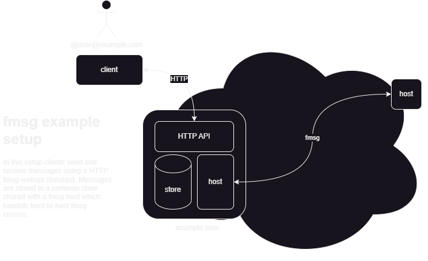

# fmsg Standards

fmsg itself only describes host-to-host communication – leaving other functionality such as retrival of messages, user identity and access management, undefined. So a full fmsg setup includes other components which would vary between deployments and use-case. For instance an enterprise Identity and Access Mangement (IAM) could be integrated on one host, and a custom user management system on another host.

This page documents some common standards for services augmenting a fmsg host.

<picture>
  <source media="(prefers-color-scheme: dark)" srcset="pics/setup-example-dark-transparent.png">
  <source media="(prefers-color-scheme: light)" srcset="pics/setup-example-light.png">
  
</picture>

## Naming Convention

Each standard is prefixed with a unique identifer following the format: "FMSG-###", where "###" is a 3 digit number.

## Standards

| Standard  | Short Description                                      |
|-----------|--------------------------------------------------------|
| [FMSG-001](standards/fmsg-001-ports.md) | Standard fmsg IP ports |
| [FMSG-002](standards/fmsg-002-fmsg-api.md) | HTTP API for the retrieval, posting, and searching of messages |

