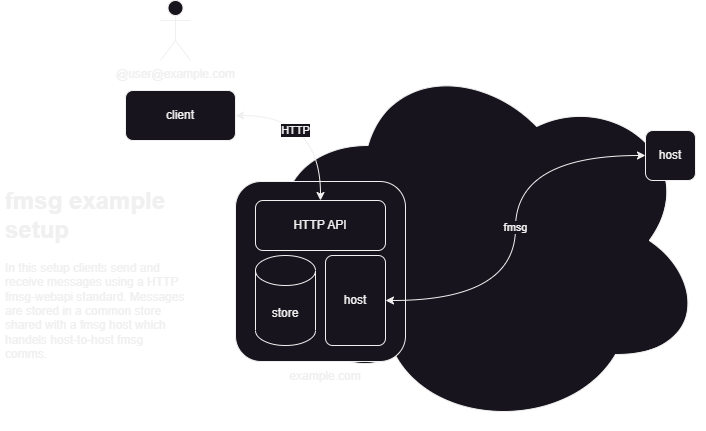

# fmsg Standards

The fmsg specification only describes host-to-host communication protocol semantics and message definitions. Implementors need to agree on transport, port bindings, encryption etc. to interoperate. Further, other functionality such as retrieval of messages, user identity and access management,  is undefined by the specification. So a full fmsg setup includes other components which could vary between deployments and use-case. For instance an enterprise identity management system could be integrated on one host, and a custom user management system on another host.

This page indexes common standards for a fmsg host to follow and services augmenting a host.

<picture>
  <source media="(prefers-color-scheme: dark)" srcset="pics/setup-example-dark-transparent.png">
  <source media="(prefers-color-scheme: light)" srcset="pics/setup-example-light.png">
  
</picture>

## Naming Convention

Each standard is prefixed with a unique identifer following the format: "FMSG-###", where "###" is a 3 digit number.

## Standards

| Standard  | Short Description                                      |
|-----------|--------------------------------------------------------|
| [FMSG-001](standards/fmsg-001-transport-and-binding.md) | TCP+TLS Transport and Binding Standard |
| [FMSG-002](standards/fmsg-002-id.md) | HTTP API spec for recipient lookup and quota limits |
| [FMSG-003](standards/fmsg-003-webapi.md) | HTTP API spec client to perform CRUD operations on messages for a specific address |

