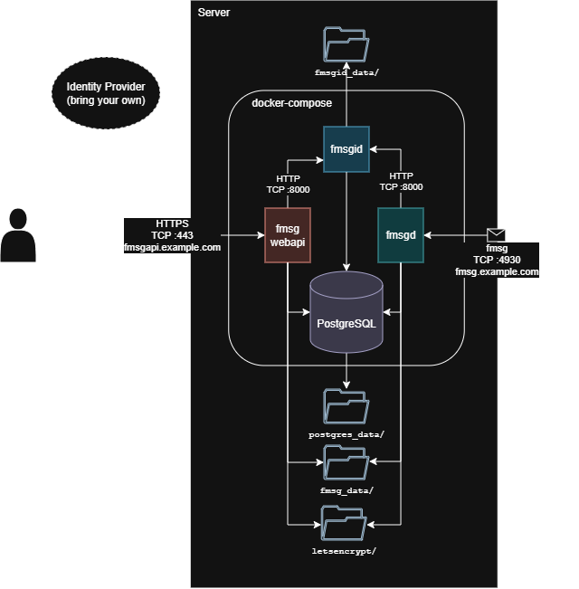

# Show HN - fmsg - An open distributed messaging protocol

   <picture>
      
   </picture>

I've been developing **fmsg**, a message definition and protocol intended as an alternative to email and Instant Messaging (IM) apps.

Like email, fmsg is distibuted - anyone can host a fmsg server for their domain with their users. Unlike email but like IM apps fmsg is efficient at conversational message exchanges. 

A full RFC style specification is hosted in this repository here: [SPECIFICATION.md](https://github.com/markmnl/fmsg/blob/main/SPECIFICATION.md) and is nearing v1.0. (Hopefully one day fmsg can become an RFC - but that requires adoption first). Aside, while using AI agents to help with implementation I distilled the full specification to a concise version to feed inference context - which can easier to follow: [SPEC.md](https://github.com/markmnl/fmsg/blob/main/SPEC.md - this was remarkably successful and I wonder if "specification driven developement", that old new thing, will be the way of the future, but I digress.. 

   <picture>
      <source media="(prefers-color-scheme: dark)" srcset="fmsg-docker-dark.png">
      <source media="(prefers-color-scheme: light)" srcset="fmsg-docker-light.png">
      
   </picture>

[fmsgd](https://github.com/markmnl/fmsgd) is a fmsg host implementation, written Go (golang has been a perfect fit with it's concurrency capability and `net` package, been a joy to implement). fmsgd is only for host-to-host comms, for a full setup including message retrival and user management I've developed [fmsg-docker](https://github.com/markmnl/fmsg-docker/blob/main/QUICKSTART.md) to get a full fmsg setup up and running in minutes. Send me a fmsg if you do! My fmsg address is: `@markmnl@fmsg.io`

# Why
A confluence of reasons motivated me to develop fmsg:
* Annoyance at how difficult hosting and operating one's own email server is today. No doubt helping  the centralisation of email providers (Gmail, Outlook, Yahoo etc.). This centralisation goes against the open distrubted promise of The Internet. 
* **Data Soveriegnty** - not just keeping one's data in a certain juridiction for legal reasons - but having control where my data sits and who has access to it. While I don't want to enable the bad guy, the fact one's mail can be retrieved behind their back from these centralised providers is a wake up call.
* Electronic messaging is becoming increasingly dominated by propitary IM apps which aren't open (WhatsApp, LINE, WeChat, Messenger, Signal, Telegram, Kakoa Talk etc.). These have the same data issue where your messages are handeled by someone else.
* Technically, the challenge of designing/crafting protocols has grown on me. Previously I had some experience in game dev net code - and learnt about Hacker News at same time when someone posted an article I wrote back then [Making Fast-Paced Multiplayer Networked Games Is Hard ](https://news.ycombinator.com/item?id=8399767), the product of which was [FalconUDP](https://github.com/markmnl/FalconUDP). During that time I developed my fondness for compact binary encoding - the fact every HTTP response contains the string: "Content-Length:" to label a number keeps me up at night. Did you know SMTP base64 encodes attachments because email is just text!

To be fair there are some self-hosted options such as Zulip, Rocket.Chat and Mattermost. Self-hosting is an important distinction compare to say: Slack, Discord or MS Teams; because self-hosting allows you handel your data. Though these still weren't what I was yearning for - they generally follow a client-server architecture were only the users known on that specific instance can communicate with eachother. I wanted something distributed like email where I could write down an address on a business card and someone could contact me at that address irrespective of the software they or I am using, i.e. a protocol! One system seems to come close which does allow users managed independently by hosts: [Matrix](https://spec.matrix.org/v1.17/), so shout out to them! Still that wasn't quite what I was after - these "Group Messaging Platforms", if you will, concern themeselves with synchronisation of messages in forums/channels/rooms (i.e. groups). _fmsg is just messages_, to receive a message someone has to send it you. Group like threads evolve naturally as participants are added. 

# How

## Messages

## The Protocol

   <picture>
      <source media="(prefers-color-scheme: dark)" srcset="flow-dark.png">
      <source media="(prefers-color-scheme: light)" srcset="flow-light.png">
      
   </picture>

# Links
