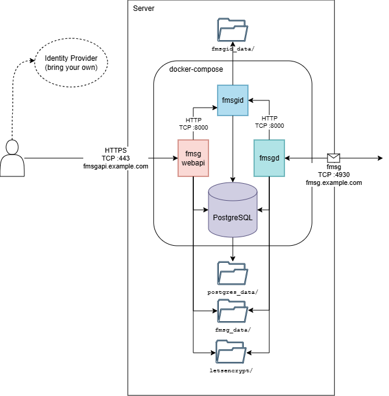

# Show HN – fmsg – An open distributed messaging protocol


<div style="float: right; margin: 1em;">
   <picture>
      
   </picture>
</div>

I've been developing **fmsg** (thought of as “f-message”, always stylised lower-case), a message definition and protocol intended as an alternative to email and Instant Messaging (IM) apps. fmsg is an open, binary, distributed messaging protocol where anyone can run a host and addresses look like `@user@domain`


A full RFC style specification is hosted in this repository here: [SPECIFICATION.md](https://github.com/markmnl/fmsg/blob/main/SPECIFICATION.md) and is nearing v1.0. (Hopefully one day fmsg can become an RFC – but that requires adoption first). Aside, while using AI agents to help with implementation I distilled the full specification to a concise version to use for context – which can be easier to follow: [SPEC.md](https://github.com/markmnl/fmsg/blob/main/SPEC.md) – this was remarkably successful and I wonder if "specification driven development", that old new thing, will be the way of the future, but I digress.. 

<div style="float: right; margin: 1em; max-width: 600px;">
   <picture>
      
   </picture>
</div>


[fmsgd](https://github.com/markmnl/fmsgd) is a fmsg host implementation, written in Go (golang has been a perfect fit with its concurrency capability and `net` package, been a joy to implement). fmsgd is only for host-to-host comms, for a full setup including message retrieval and user management I've developed [fmsg-docker](https://github.com/markmnl/fmsg-docker/blob/main/QUICKSTART.md) to get a full fmsg setup up and running in minutes. Send me a fmsg if you do! My fmsg address is: `@markmnl@fmsg.io`


# Why
A confluence of reasons motivated me to develop fmsg:
* Annoyance at how difficult hosting and operating one's own email server is today. No doubt helping the centralisation of email providers (Gmail, Outlook, Yahoo etc.). This centralisation goes against the open distributed promise of The Internet. 
* **Data Sovereignty** – not just keeping one's data in a certain jurisdiction for legal reasons – but having control where my data sits and who has access to it. While I don't want to enable the bad guy, the fact one's mail can be retrieved behind their back from these centralised providers is a wake up call.
* Electronic messaging is becoming increasingly dominated by proprietary IM apps which aren't open (WhatsApp, LINE, WeChat, Messenger, Telegram, Kakao Talk etc.). These have the same data issue where your messages are handled by someone else.
* Technically, the challenge of designing/crafting protocols has grown on me. Previously I had some experience in game dev net code – and learnt about Hacker News at same time when someone posted an article I wrote back then [Making Fast-Paced Multiplayer Networked Games Is Hard ](https://news.ycombinator.com/item?id=8399767), the product of which was [FalconUDP](https://github.com/markmnl/FalconUDP). During that time I developed my fondness for compact binary encoding – the fact every HTTP response contains the string: "Content-Length:" to label a number, feel excessive. Did you know SMTP base64 encodes attachments because email is just text!

To be fair there are some self-hosted options such as Zulip, Rocket.Chat and Mattermost. Self-hosting is an important distinction compared to say: Slack, Discord or MS Teams; because self-hosting allows you to handle your data. Though these still weren't what I was yearning for – they generally follow a client-server architecture where only the users known on that specific instance can communicate with each other. I wanted something distributed like email where I could write down an address on a business card and someone could contact me at that address irrespective of the software they or I am using, i.e. a protocol! One system that seems to come close, which does allow users managed independently by hosts is [Matrix](https://spec.matrix.org/v1.17/), so shout out to them! Still that wasn't quite what I was after – these "Group Messaging Platforms", if you will, concern themselves with synchronisation of messages in forums/channels/rooms (i.e. groups). They are also built as HTTP APIs so cannot do things a dedicated protocol like fmsg does opening a connection back to the sender during tranmission.

_fmsg is just messages_, to receive a message someone has to send it you. Group like threads evolve naturally as participants are added. 


# How

Those paying attention may be wondering if fmsg allows unsolicited messages (a feature not a bug), how is it going to deal with spam?! Spam will still be a problem but the protocol design has sender verification and message integrity built-in. So from the get go you get what you would get if you setup email with SPF, DKIM, DMARC – highlighting the complexity of productionizing email today. fmsg achieves this using a novel [automatic challenge](https://github.com/markmnl/fmsg/blob/main/SPECIFICATION.md#2-the-automatic-challenge) back to the sender during sending after receiving the header and verifying that's acceptable first. Also the directed acyclic graph that builds as threads grow can prove previous participation providing a signal to spam filtering..

## Messages

 Messages are sent via a fmsg host to one or more recipients. Each message in a thread is linked to the previous using a cryptographic hash. The wire encoding is defined here: [Message Definition](https://github.com/markmnl/fmsg/blob/main/SPECIFICATION.md#message), but an easier way to see the structure is as JSON:

```JSON
{
    "version": 1,
    "important": false,
    "noreply": false,
    "pid": null,
    "from": "@user@example.com",
    "to": [
        "@世界@example.com",
        "@chris@example.edu"
    ],
    "time": 1654503265.679954,
    "topic": "Hello fmsg!",
    "type": "text/plain;charset=UTF-8",
    "size": 45,
    "data": "The quick brown fox jumps over the lazy dog.",
    "attachments": [
        {
            "type": "application/pdf",
            "filename": "doc.pdf",
            "size": 1024
        }
    ]
}
```


## The Protocol

To quote the spec:

> A message is sent from the sender's host to each unique recipient host...During the sending from one host to another several steps are performed depicted in the below diagram. Two connection-orientated, reliable, in-order and duplex transports are required to perform the full flow. Transmission Control Protocol (TCP) is an obvious choice, on top of which Transport Layer Security (TLS) may meet your encryption needs. This specification is independent of transport mechanisms which are instead defined as standards such as: [FMSG-001 TCP+TLS Transport and Binding Standard](https://github.com/markmnl/fmsg/blob/main/standards/fmsg-001-transport-and-binding.md). 

<p align="center">
   <picture>
      
   </picture>
</p>


# Next Steps

* Testing, hardening and fine-tuning the implementation and specification hand-in-hand. An approach I heard [Vint Cerf](https://en.wikipedia.org/wiki/Vint_Cerf) say they used when developing TCP which he attributed part of its success to. It's simply too hard to think of everything in advance then implement, on the other hand you need an idea and plan written out first to help think through and stipulate the logic, then iterate.
* Spreading the word, adoption, building a community behind fmsg. (The intent of this post)
* Clients – currently there is only [fmsg-cli](https://github.com/markmnl/fmsg-cli) which uses [fmsg-webapi](https://github.com/markmnl/fmsg-webapi), building UIs is TODO!
* Finalising v1.0 and finishing the white paper I have started.

Then who knows what products could be built on fmsg...


Regards,
Mark
